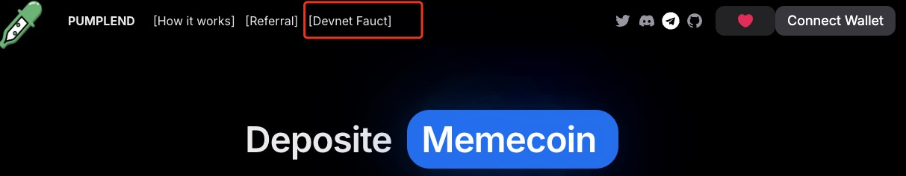

# How to use

<figure><figcaption></figcaption></figure>

## Max Buy

&#x20;Step 1: Select a Pump coin you want to buy .

&#x20;Step 2:Deposit SOL to get the max coins. Confirm to execute loop borrowing and finish buy.

&#x20;Step 3:Click "Close" to exit the position and get SOL, or click "Repay" to pay interest and get coins.

## Max Borrow

Step 1: Select a Pump coin you want to use as collateral.

Step 2: Borrow out SOL.

Step 3: Click "Repay" to pay SOL and interest to redeem Pump coins. Click "Close" to sell coins and get SOL.

## Stak SOL

Step1:Click “Supply" to deposit SOL and earn interest.

Step2:Click "Withdraw" to withdraw your SOL and interest.
